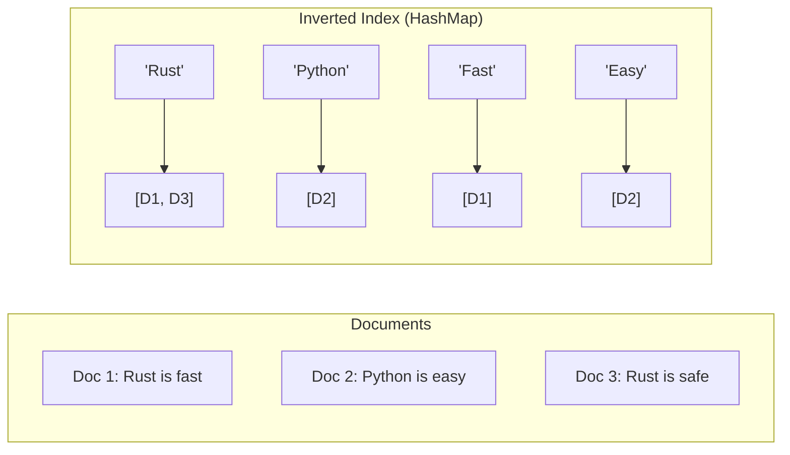

# 🗂️ Step 1: Indexing & The Inverted Index

## The Problem: The Naive Search
Imagine you have 1,000 documents and you want to find the word "Algorithm".
- **Naive Way:** Open every document, read every line, and check if "Algorithm" exists.
- **Complexity:** $O(N \times L)$ where $N$ is number of docs and $L$ is average length.
- **Real-world:** For 100 Billion web pages, this would take years for a single search.

---

## The Solution: Inverted Index
Instead of mapping **Document -> Words**, we map **Word -> Documents**.

### 🛠️ Data Structure: HashMap
The core of indexing is a **HashMap (Hash Table)** where:
- **Key:** A unique word (token).
- **Value:** A list of Document IDs (called a **Postings List**).

### Visual Representation

---

## 🚀 Why is this fast?
Searching for "Rust" now takes **O(1)** time to find the key in the HashMap and **O(k)** to retrieve the list of $k$ documents. 

### 💡 Real-Time Example: A Book Index
Think of the index at the back of a textbook. You don't flip through every page to find "Recursion". You go to the 'R' section in the index, find "Recursion", and it gives you page numbers: `12, 45, 102`.

---

## 🔍 Advanced Concept: Boolean Queries
If you search for **"Rust Tutorial"**:
1. Get list for "Rust": `[1, 5, 10, 20]`
2. Get list for "Tutorial": `[5, 12, 20, 31]`
3. **Intersection (AND):** Using a two-pointer approach on sorted lists, we find `[5, 20]` in $O(M+N)$ time.

---

### [Next: Autocomplete with Tries ➡️](./02_trie_autocomplete.md)
