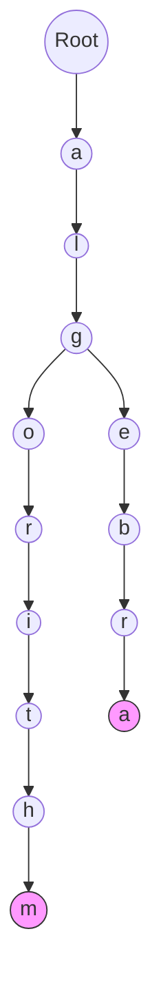

# ⌨️ Step 2: Autocomplete & The Trie

## The Problem: "Did you mean...?"
When you type `alg`, Google immediately suggests `algorithm`, `algebra`, `algorithmic`. 
- **Wait, why not HashMap?** 
  Looking up "alg" in a HashMap won't tell you about "algorithm" because the keys are different. You would need to scan all keys—$O(Words)$—which is too slow.

---

## The Solution: Trie (Prefix Tree)
A **Trie** is a specialized tree structure used for retrieval. Every node represents a character.

### 🛠️ Data Structure: Trie
- Each node has multiple children (one for each possible character).
- Paths from the root to a node represent a **prefix**.
- Nodes can have a flag `isEndOfWord`.

### Visual Representation

---

## ⚡ Key Learning
- **Search Complexity:** $O(L)$ where $L$ is the length of the string you typed.
- **Independence:** It doesn't matter if you have 10 keywords or 10 billion; searching "apple" only takes 5 steps.

---

## 💡 Real-Time Example: Mobile Keyboards
The predictive text on your iPhone or Android uses a variant of a Trie (often combined with a Language Model/AI) to predict your next word based on the prefix you've typed.

---

## 🛠️ Performance Peek
In a Google-scale Trie:
1. We store the **Top-K** most popular completions at each node.
2. If you type "a", the node 'a' already knows that the most popular words starting with 'a' are "amazon", "apple", and "alphabet". 
3. This avoids traversing the entire subtree during the search.

---

### [Next: Ranking with Heaps ➡️](./03_ranking_heap.md)
