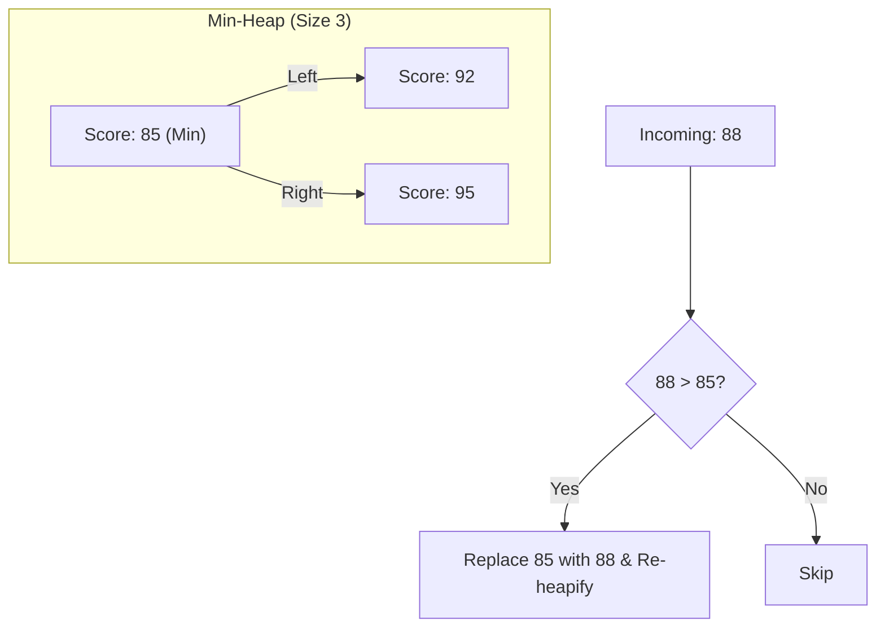

# 🏆 Step 3: Ranking & The Heap

## The Problem: Information Overload
A search for "Pizza" might return 500 million pages. 
- You only care about the **Top 10**.
- **Naive Way:** Sort all 500 million pages by relevance $O(N \log N)$.
- **Bottleneck:** Sorting everything just to get the top 10 is a massive waste of CPU.

---

## The Solution: Min-Heap (Priority Queue)
To find the **Top-K** elements, we use a **Min-Heap** of size $K$.

### 🛠️ Algorithm: The Top-K Pattern
1. Create a Min-Heap of size $K$ (e.g., 10).
2. For every document in the result set:
   - Calculate its **Score** (Relevance + PageRank).
   - If the score > heap's minimum (root):
     - Remove the root.
     - Insert the new document score into the heap.
3. At the end, the heap contains the 10 best documents.

### Visual Representation

---

## ⚡ Complexity Comparison
- **Sorting:** $O(N \log N)$
- **Heap (Top-K):** $O(N \log K)$
- Since $K$ (10 results) is much smaller than $N$ (500M results), the Heap is drastically faster.

---

## 💡 Real-Time Example: Leaderboards
In online games like *PUBG* or *Valorant*, the global leaderboard doesn't sort millions of players in real-time. They maintain a data structure (like a Heap or a Sorted Set in Redis) to track only the Top players.

---

## 🔍 How is "Score" calculated?
A document score isn't just word frequency. It's a mix of:
- **TF-IDF:** How relevant is the word to the doc?
- **Recency:** Is it news or old data?
- **Location:** Is the user searching for "pizza" in Tokyo or NYC?
- **PageRank:** How important is this website?

---

### [Next: The Web as a Graph ➡️](./04_graph_pagerank.md)
