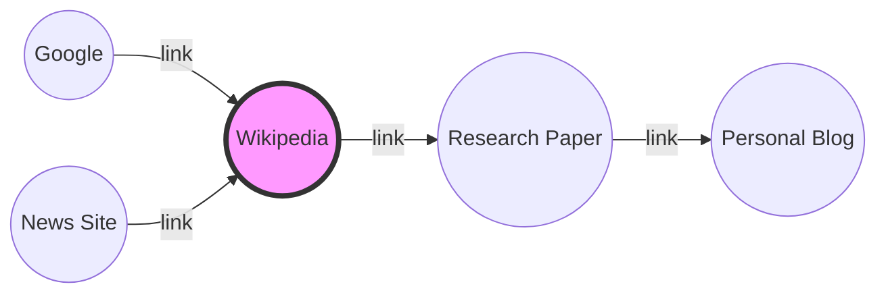

# 🕸️ Step 4: The Web Graph & PageRank

## The Problem: Authoritativeness
If two pages both mention "Recursion" 5 times, which one should Google show first?
- **Implicit Signal:** If many high-quality websites link to Page A, Page A is likely better than Page B.

---

## The Solution: Graphs
The internet is essentially a giant **Directed Graph**.
- **Nodes:** Web Pages
- **Edges:** Hyperlinks

### Visual Representation

---

## 🛠️ Algorithm: PageRank (Simplified)
Developed by Larry Page and Sergey Brin, PageRank assigns a numerical weight to each element of a hyperlinked set of documents.

1. **Vote from Links:** A link from Page A to Page B is counted as a "vote" for Page B.
2. **Weight of the Vote:** A vote from an important page (like Wikipedia) counts more than a vote from a random blog.
3. **Recursive Importance:** Your importance is the sum of the importance of pages that link to you.

---

## 🚀 DSA at Work: Adjacency Lists
To store the web graph, we use an **Adjacency List**.
- `Map<URL, List<URL>>`
- The **Crawler** traverses this graph using **BFS (Breadth-First Search)** or **DFS (Depth-First Search)** to discover new pages.

---

## 💡 Real-Time Example: LinkedIn Connections
Think of LinkedIn. A person with 500+ meaningful connections (edges) is more "findable" and appears higher in recruitment searches than someone with 2 connections. This is a graph-based social ranking.

---

## ⚠️ The "Spider" Hole (Challenges)
- **Cycles:** Crawlers can get stuck in infinite loops.
- **Dead Ends:** Pages with no outgoing links.
- **Trap Pages:** Pages designed to keep crawlers stuck to manipulate rankings.

---

### [Next: Scaling to Billions (System Design) ➡️](./05_system_design.md)
