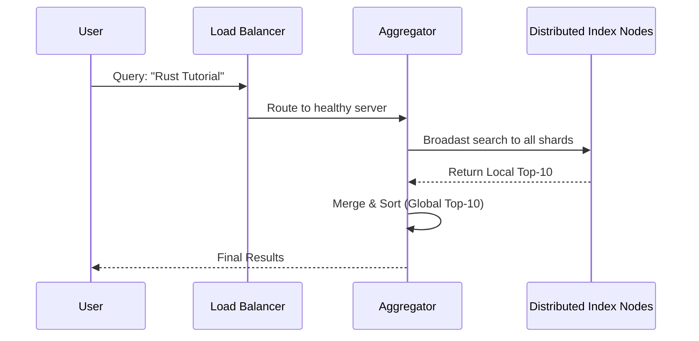

# 🏗️ Step 5: System Design - Scaling to Billions

## The Problem: "It doesn't fit in my RAM"
The total web index is **Exabytes** of data. No single computer can store it.
- **Constraints:**
    - Low Latency (< 200ms)
    - High Availability (Google must never be "down")
    - Freshness (New news should appear instantly)

---

## The Solution: Distributed Systems

### 1. Sharding (Horizontal Partitioning)
Instead of one giant Inverted Index, we split it across thousands of servers.
- **Document-based Sharding:** Server 1 has docs 1-1M, Server 2 has 1M-2M.
- **Term-based Sharding:** Server A has words starting with 'A-F', Server B has 'G-L'.

### 2. The Search Flow

---

## 🛠️ Key Components

| Component | Responsibility | DSA / Tech |
| :--- | :--- | :--- |
| **Crawler** | Finds new pages | BFS / DFS / Graph Traversal |
| **Indexers** | Builds the Inverted Index | MapReduce / Parallel Processing |
| **Caches** | Stores frequent searches | LRU Cache / Redis |
| **Ranker** | Computes importance | PageRank / Machine Learning |

---

## 💡 Real-Time Example: Black Friday Sales
During events like Black Friday, search engines (like Amazon's) handle massive spikes.
1. **Load Balancers** distribute the traffic.
2. **Auto-scaling** adds more Index nodes.
3. **Caching** ensures that common searches for "Deals" or "iPhone" are served in < 10ms without hitting the main database.

---

## 🏁 Summary: Why DSA Matters
Google Search isn't just "magic". It's a symphony of:
- **HashMaps** for lookup.
- **Tries** for autocomplete.
- **Heaps** for ranking.
- **Graphs** for importance.
- **Distributed Systems** for scale.

---

### [⬅️ Back to Home](./README.md)
