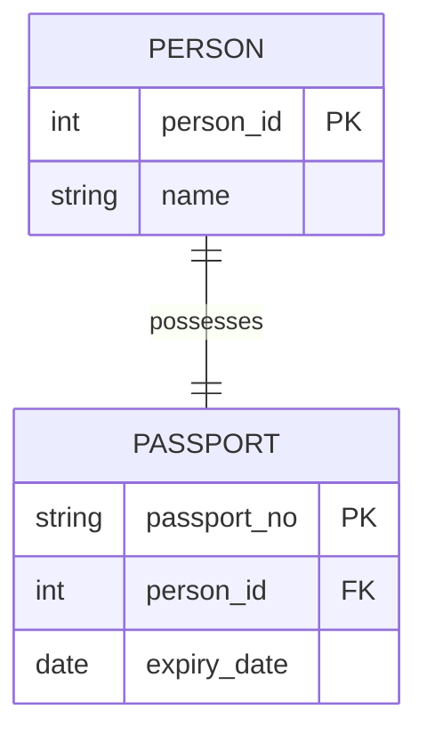
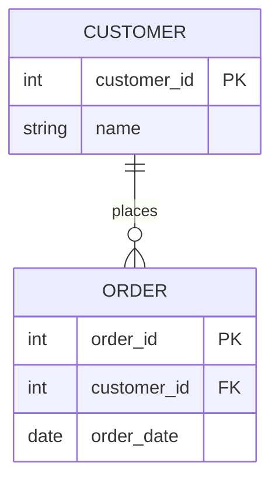
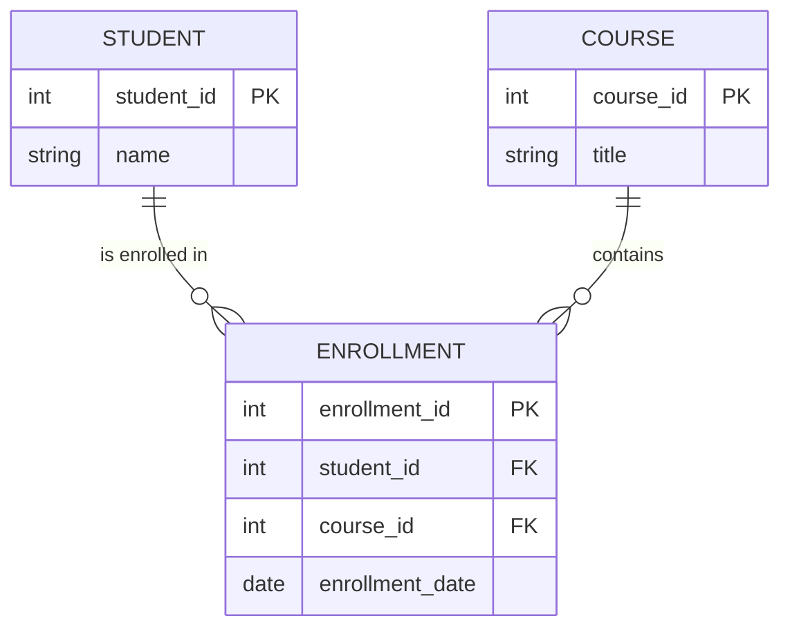
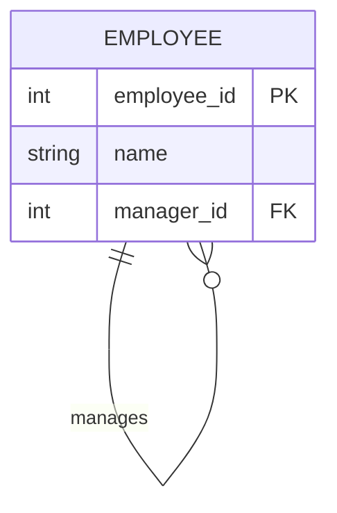

# 🏘️ Database Relationships Visualized

In RDBMS, relationships define how focus-specific tables connect to each other. Understanding these is the key to designing scalable database schemas.

---

## 1. One-to-One (1:1)
Each record in Table A is related to exactly one record in Table B.

**Real-world Example**: **Person & Passport**. One person has one passport, and one passport belongs to one person.

**Why use 1:1?**
- To separate sensitive data (e.g., security details) into a different table.
- To divide a table with too many columns to improve performance.

---

## 2. One-to-Many (1:N)
A single record in Table A can be related to multiple records in Table B, but a record in Table B relates to only one in Table A.

**Real-world Example**: **Customer & Orders**. One customer can place many orders, but an order belongs to only one customer.

**Key Point**: The "Many" side (Orders) always holds the **Foreign Key**.

---

## 3. Many-to-Many (M:N)
Multiple records in Table A are related to multiple records in Table B. This **cannot** be implemented directly in RDBMS. We use a **Junction Table** (or Associative Table) to break it into two 1:N relationships.

**Real-world Example**: **Students & Courses**. One student can enroll in many courses, and one course can have many students.

**Implementation**: The `ENROLLMENT` table bridges the gap.

---

## 4. Self-Referencing (Recursive) Relation
A table that has a relationship with itself.

**Real-world Example**: **Employee & Manager**. A manager is also an employee.

**Data Example**:
| employee_id | name | manager_id |
| :--- | :--- | :--- |
| 1 | Alice (CEO) | NULL |
| 2 | Bob (VP) | 1 |
| 3 | Charlie (Dev) | 2 |

---

## 5. Identifying vs Non-Identifying Relations
- **Identifying**: The child entity cannot exist without the parent (e.g., `OrderLines` for an `Order`).
- **Non-Identifying**: The child can exist independently (e.g., `Products` in an `OrderLine`).

---

## 💡 Quick Summary Table

| Relation Type | Symbol | FK Location | Common Example |
| :--- | :--- | :--- | :--- |
| **1:1** | `||--||` | Either side (usually child) | User & Profile |
| **1:N** | `||--o{` | The "Many" side | Author & Books |
| **M:N** | `}o--o{` | In Junction Table | Items & Categories |
