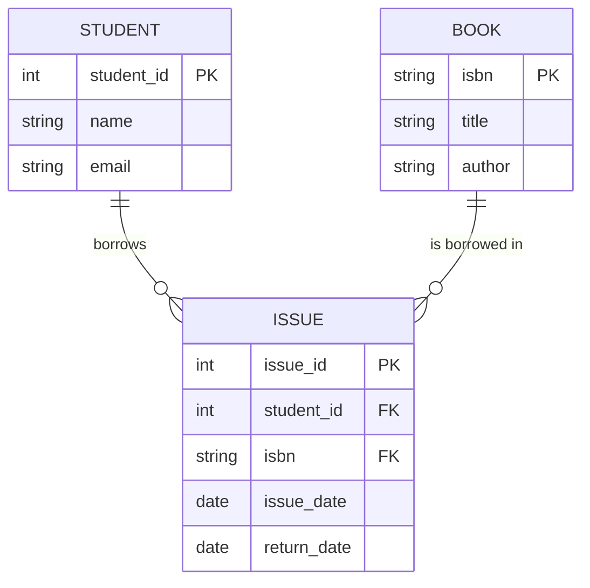

# 🔍 Deep Dive: Library ER Model (Student–Book–Issue)

The relationship between **Students**, **Books**, and **Issues** is a classic example used to teach the core concepts of Relational Databases. It perfectly illustrates how several separate tables come together to form a cohesive system.

---

## 1. The Core Entities

### A. Student (The "Who")
Stores unique information about the borrower.
- **Attributes**: `student_id` (PK), `name`, `email`, `department`.

### B. Book (The "What")
Stores unique information about the items available to borrow.
- **Attributes**: `isbn` (PK), `title`, `author`, `total_copies`.

### C. Issue / Transaction (The "When & How")
This is the **Junction Table**. It connects a Student to a Book.
- **Attributes**: `issue_id` (PK), `student_id` (FK), `isbn` (FK), `issue_date`, `return_date`.

---

## 2. Visualization of Relationships



---

## 3. Concrete Row-Level Examples

### Table: Students
| student_id (PK) | name | email |
| :--- | :--- | :--- |
| 101 | Alice | alice@univ.edu |
| 102 | Bob | bob@univ.edu |

### Table: Books
| isbn (PK) | title | author |
| :--- | :--- | :--- |
| ISBN-111 | Python Basics | John Doe |
| ISBN-222 | SQL Mastery | Jane Smith |

### Table: Issues (Linking Students to Books)
| issue_id (PK) | student_id (FK) | isbn (FK) | issue_date | return_date |
| :--- | :--- | :--- | :--- | :--- |
| 1 | 101 | ISBN-111 | 2024-04-01 | 2024-04-10 |
| 2 | 101 | ISBN-222 | 2024-04-05 | NULL |
| 3 | 102 | ISBN-111 | 2024-04-12 | NULL |

---

## 4. Key Scenarios & Examples

### Scenario 1: One Student, Many Books (1:N)
Alice (`student_id: 101`) is a research student. She has borrowed two different books.
- **Issue #1**: Alice borrows "Python Basics".
- **Issue #2**: Alice borrows "SQL Mastery".
- **Result**: In the `Issues` table, you see multiple rows with the same `student_id` but different `isbn`.

### Scenario 2: One Book Borrowed by Many Students over time (M:N)
"Python Basics" (`isbn: ISBN-111`) is a bestseller.
- First, Alice borrowed it (**Issue #1**).
- After Alice returned it, Bob borrowed it (**Issue #3**).
- **Result**: The `Issues` table tracks the entire history of who had which book and when.

### Scenario 3: Real-time Availability (Stock Calculation)
If a student wants to borrow "SQL Mastery", the system runs a check:
```sql
SELECT (B.total_copies - COUNT(I.issue_id)) as available
FROM Books B
JOIN Issues I ON B.isbn = I.isbn
WHERE B.isbn = 'ISBN-222' AND I.return_date IS NULL;
```
If the count equals the total copies, the student is told "Book already issued".

---

## 5. Why separate them? (Avoid the "Flat File" trap)

Imagine if we put everything in ONE table:

| student_id | name | book_title | issue_date |
| :--- | :--- | :--- | :--- |
| 101 | Alice | Python Basics | 2024-04-01 |
| 101 | Alice | SQL Mastery | 2024-04-05 |

**The Problems:**
1.  **Redundancy**: If Alice changes her name, you have to update it in every row she appears.
2.  **Deletion Loss**: If you delete the issue record because the book was returned, you might lose the information that the student "Alice" even exists if that was her only record.
3.  **No "Zero" State**: You can't store a Book that hasn't been issued yet without having `NULL` values for student columns.

**In the RDBMS Model:**
- **Books** exist independently of whether they are issued.
- **Students** exist independently of whether they borrow books.
- **Issues** only exist when an interaction occurs.

---

## 6. How it looks in Frameworks (ORMs)

### Django (Python)
```python
# The relationships are handled via 'ForeignKey'
class Issue(models.Model):
    student = models.ForeignKey(Student, on_delete=models.CASCADE)
    book = models.ForeignKey(Book, on_delete=models.CASCADE)
    issue_date = models.DateField()
```

### Hibernate (Java)
```java
@Entity
public class Issue {
    @ManyToOne
    @JoinColumn(name = "student_id")
    private Student student;

    @ManyToOne
    @JoinColumn(name = "isbn")
    private Book book;
}
```
