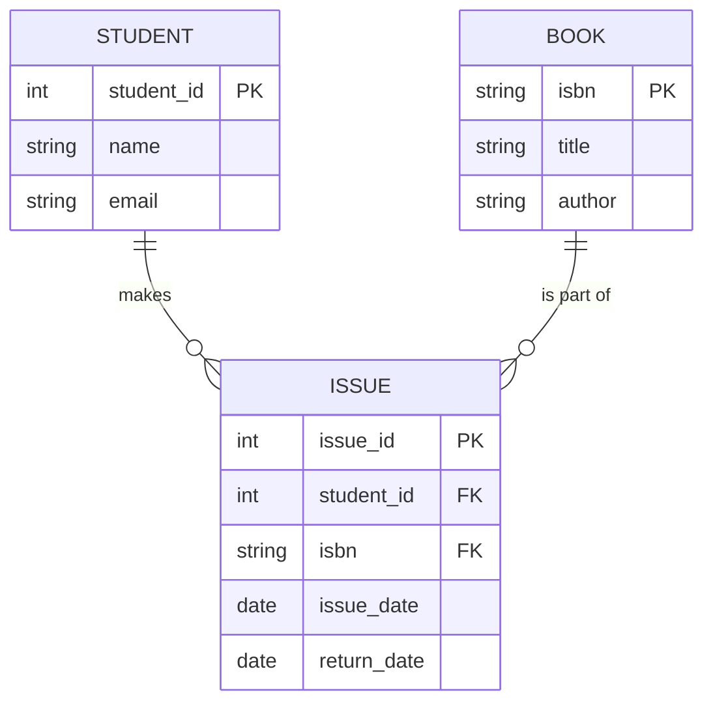

# 🗄️ Relational Database Management Systems (RDBMS) Mastery Guide

Welcome to the comprehensive guide on RDBMS. This document is designed to take you from a basic understanding of data storage to mastering complex relational designs and advanced SQL querying, tailored for software engineering placements.

---

## 1. What is a Database?
### Introduction
At its core, a **Database** is an organized collection of structured information, or data, typically stored electronically in a computer system. While a simple text file can store data, a database provides the "intelligence" to query, update, and manage that data efficiently.

### File System vs. DBMS: The Real-World Comparison
Imagine you are managing a college library.

| Feature | **File System (e.g., Excel/CSV)** | **Database Management System (DBMS)** |
| :--- | :--- | :--- |
| **Data Redundancy** | High. You might type the same student name in multiple sheets. | Low. Data is normalized and stored once. |
| **Integrity** | Easy to enter "abc" in a "Phone Number" column. | Constraints ensure only valid data types are stored. |
| **Concurrency** | Hard for 10 librarians to update the same file simultaneously. | Multi-user access with locking mechanisms. |
| **Security** | Usually file-level passwords only. | Granular permissions (User X can read, but not delete). |

**Real Example:**
- **Excel:** Storing a list of "Books Issued" where you manually type the student's name every time. If they change their name, you must update 100 rows.
- **DBMS:** Storing a `Student_ID`. The name is stored in a separate `Students` table. Change it once, and it reflects everywhere.

---

## 2. RDBMS vs. NoSQL
### The Relational Focus
While NoSQL (like MongoDB) is excellent for unstructured data and rapid scaling, **RDBMS** (Relational Database Management System) remains the backbone of the financial, healthcare, and enterprise sectors due to its strict structure and consistency.

| Feature | **RDBMS (SQL)** | **NoSQL (Document/KV/Graph)** |
| :--- | :--- | :--- |
| **Structure** | Fixed Schema (Tables/Rows/Columns) | Dynamic Schema (JSON-like documents) |
| **Relationships** | Established via Foreign Keys | Usually nested data (Embedding) or manual linking |
| **Transactions** | ACID Compliant (Focus on Reliability) | BASE (Focus on Availability and Speed) |
| **Use Case** | Complex queries, strict data integrity | Big data, real-time web apps, social feeds |

---

## 3. ER Model: Entities, Attributes, & Relationships
The **Entity-Relationship (ER) Model** is the blueprint of your database.

### Core Concepts:
- **Entity**: A real-world object (e.g., `Student`, `Book`).
- **Attribute**: Properties of an entity (e.g., `Student_Name`, `Book_ISBN`).
- **Relationship**: How entities interact (e.g., Student **Issues** Book).
- **Cardinality**: The numerical constraint of the relationship.

### Framework Implementation: Django Models
In Django, your ER model is defined directly in Python classes:
```python
class Student(models.Model):
    name = models.CharField(max_length=100)

class Book(models.Model):
    title = models.CharField(max_length=200)

class Issue(models.Model):
    student = models.ForeignKey(Student, on_delete=models.CASCADE) # Many-to-One
    book = models.ForeignKey(Book, on_delete=models.CASCADE)
    issue_date = models.DateField(auto_now_add=True)
```

### Library ER Visualization (Student–Book–Issue)

**Cardinality Explanation:**
- **One-to-Many (1:N):** One student can have many issues, but one issue record belongs to one student.
- **Many-to-Many (M:N):** Students and Books have a many-to-many relationship, which is resolved via the `ISSUE` (Junction) table.

---

## 4. Keys: The Identity of Data
Keys are used to establish and identify relationships between tables.

1.  **Primary Key (PK):** A unique identifier for a record (e.g., `Roll_No`). Cannot be NULL.
2.  **Candidate Key:** Any column that *could* be a Primary Key (e.g., `Email`, `Passport_No`).
3.  **Foreign Key (FK):** A column that refers to a PK in another table, establishing a link.
4.  **Composite Key:** A Primary Key composed of two or more columns (e.g., `Course_ID` + `Semester`).

---

## 5. SQL Data Types & Constraints
### Common Data Types
- `INT`, `BIGINT`: Numbers.
- `VARCHAR(N)`: Strings with dynamic length.
- `DATE`, `TIMESTAMP`: Time-related data.
- `DECIMAL(P, S)`: Precise numbers for currency.

### Constraints (Rules for Data)
- `NOT NULL`: Ensures a column cannot be empty.
- `UNIQUE`: Ensures all values in a column are different.
- `DEFAULT`: Sets a value if none is provided.
- `CHECK`: Ensures values meet a specific condition (e.g., `Age > 18`).

---

## 6. DDL: Data Definition Language
DDL is used to define the **structure** of the database.

```sql
-- CREATE: Building the table
CREATE TABLE Students (
    student_id INT PRIMARY KEY,
    name VARCHAR(100) NOT NULL,
    email VARCHAR(100) UNIQUE,
    enrollment_date DATE DEFAULT CURRENT_DATE
);

-- ALTER: Modifying the structure
ALTER TABLE Students ADD phone_number VARCHAR(15);

-- DROP: Deleting the entire table
-- DROP TABLE Students;
```

---

## 7. DML: Data Manipulation Language
DML is used to manage the **data** within the structure.

```sql
-- INSERT: Adding records
INSERT INTO Students (student_id, name, email) 
VALUES (1, 'Alice Johnson', 'alice@college.edu');

-- UPDATE: Changing existing data
UPDATE Students 
SET email = 'alice.j@college.edu' 
WHERE student_id = 1;

-- DELETE: Removing records
DELETE FROM Students WHERE student_id = 1;
```

---

## 8. DQL: Data Query Language
DQL is used to **retrieve** data.

```sql
SELECT name, email 
FROM Students 
WHERE enrollment_date > '2023-01-01' 
ORDER BY name ASC 
LIMIT 10;

-- DISTINCT: Get unique values
SELECT DISTINCT author FROM Books;
```

---

## 9. Real-World Walkthrough: Build “Student Library” DB
### Step 1: Define Entities
- **Student**: ID, Name, Dept
- **Book**: ISBN, Title, Author, Category
- **Issue**: IssueID, StudentID, ISBN, IssueDate

### Step 2: Create Tables
```sql
CREATE TABLE Books (
    isbn VARCHAR(20) PRIMARY KEY,
    title VARCHAR(200),
    author VARCHAR(100),
    category VARCHAR(50)
);

CREATE TABLE Issues (
    issue_id SERIAL PRIMARY KEY,
    student_id INT REFERENCES Students(student_id),
    isbn VARCHAR(20) REFERENCES Books(isbn),
    issue_date DATE
);
```

---

## 10. Joins: Connecting the Dots
Joins allow you to retrieve data from multiple tables in a single result set.

- **INNER JOIN**: Returns records with matching values in both tables.
- **LEFT JOIN**: Returns all records from the left table, and matched records from the right.
- **RIGHT JOIN**: Returns all records from the right table, and matched records from the left.
- **FULL JOIN**: Returns all records when there is a match in either table.
- **SELF JOIN**: Joining a table with itself (e.g., Employee and their Manager in the same table).

### Framework Implementation: Hibernate (HQL)
In Java/Hibernate, Joins are often handled via object navigation:
```sql
-- Fetching students and their books in HQL
SELECT s.name, b.title 
FROM Student s 
JOIN s.issues i 
JOIN i.book b
```

### Library Example: Student + Book + Issue Details
```sql
SELECT 
    S.name AS Student_Name, 
    B.title AS Book_Title, 
    I.issue_date
FROM Students S
INNER JOIN Issues I ON S.student_id = I.student_id
INNER JOIN Books B ON I.isbn = B.isbn;
```

---

## 11. Subqueries & Correlated Subqueries
A **Subquery** is a query nested inside another query.

**Normal Subquery:**
```sql
-- Find books written by the same author as 'Database System Concepts'
SELECT title FROM Books 
WHERE author = (SELECT author FROM Books WHERE title = 'Database System Concepts');
```

**Correlated Subquery:**
A query where the inner query depends on the outer query's values.
```sql
-- Find students who have issued more than the average number of books
SELECT name FROM Students S 
WHERE (SELECT COUNT(*) FROM Issues I WHERE I.student_id = S.student_id) > 
      (SELECT COUNT(*) / COUNT(DISTINCT student_id) FROM Issues);
```

---

## 12. Aggregate Functions + GROUP BY + HAVING
Aggregate functions perform a calculation on a set of values and return a single value.

- `COUNT()`, `SUM()`, `AVG()`, `MIN()`, `MAX()`

```sql
SELECT category, COUNT(*) as book_count
FROM Books
GROUP BY category
HAVING COUNT(*) > 5; -- Filter groups, not individual rows
```

---

## 13. Normalization (1NF–3NF–BCNF)
Normalization is the process of organizing data to minimize redundancy and avoid anomalies.

### Anomalies with Bad Design:
- **Insertion Anomaly**: Cannot add a book unless a student issues it.
- **Deletion Anomaly**: If a student returns a book and we delete the record, we might lose information about the book itself.
- **Update Anomaly**: If a book title changes, we have to update it in 100 issue records.

### The Steps:
1.  **1NF**: Atomic values (no lists in a cell), unique column names.
2.  **2NF**: In 1NF + No partial dependency (every non-key attribute must depend on the *whole* primary key).
3.  **3NF**: In 2NF + No transitive dependency (non-key attributes should not depend on other non-key attributes).
4.  **BCNF**: A stronger version of 3NF where for every functional dependency X -> Y, X must be a superkey.

---

## 14. ACID Properties & Transactions
A **Transaction** is a logical unit of work.

- **Atomicity**: All or Nothing.
- **Consistency**: Database moves from one valid state to another.
- **Isolation**: Concurrent transactions don't interfere.
- **Durability**: Once committed, data stays even during a crash.

### Framework Implementation: Spring Boot (@Transactional)
In Java Spring, you can ensure ACID properties with a simple annotation:
```java
@Transactional
public void transferBalance(String fromAcc, String toAcc, long amount) {
    accountRepo.withdraw(fromAcc, amount);
    accountRepo.deposit(toAcc, amount);
    // If an exception occurs here, both withdraw and deposit are rolled back.
}
```

**Bank Transfer Example SQL:**
```sql
BEGIN TRANSACTION;
UPDATE Accounts SET balance = balance - 100 WHERE account_id = 'A';
UPDATE Accounts SET balance = balance + 100 WHERE account_id = 'B';
COMMIT; -- If any step fails, use ROLLBACK;
```

---

## 15. Indexes, Views, & Advanced Constraints
- **Index**: A data structure that speeds up data retrieval (like a book index). Trade-off: Slower writes.
- **View**: A virtual table based on a SQL result. Keeps complex queries clean.
- **Constraints**: 
    - `UNIQUE`: No duplicates.
    - `CHECK`: Logical validation (e.g., `CHECK (price > 0)`).

---

## 16. Python Integration: The Database Layer
Modern frameworks (Django, Flask) use ORMs, but understanding the driver level is crucial.

```python
import sqlite3

def issue_book(student_id, isbn):
    conn = None
    try:
        conn = sqlite3.connect('library.db')
        cursor = conn.cursor()
        
        # Start a transaction
        cursor.execute("BEGIN TRANSACTION;")
        
        # 1. Check if book is available
        # 2. Insert into Issues
        cursor.execute("INSERT INTO Issues (student_id, isbn, issue_date) VALUES (?, ?, CURRENT_DATE)", (student_id, isbn))
        
        # 3. Update Book Stock
        cursor.execute("UPDATE Books SET available_copies = available_copies - 1 WHERE isbn = ?", (isbn,))
        
        # Commit the transaction if everything is successful
        conn.commit()
        print("Book issued successfully!")
            
    except sqlite3.Error as e:
        # Rollback in case of any error
        if conn:
            conn.rollback()
        print(f"Transaction failed. Database error: {e}")
    finally:
        if conn:
            conn.close()
```

---

## 🎯 Assignments

1.  **ER Design**: Design an ER model for an Online Food Delivery system (Customer, Restaurant, Dish, Order). List the primary and foreign keys.
2.  **The Subquery Challenge**: Write a query to find the second-highest borrowed book in the library using a subquery.
3.  **Normalization Task**: A table stores `(StudentID, StudentName, CourseID, CourseName, InstructorName)`. Identify the partial and transitive dependencies and normalize it to 3NF.
4.  **SQL Practice**: Write a SQL statement using `LEFT JOIN` and `GROUP BY` to list all students and the count of books they have issued, including students who have issued 0 books.
5.  **Transaction Logic**: Write a pseudocode for a transaction that handles a "Book Return" process: Update `return_date` in `Issues` and increment `stock_count` in `Books`. Ensure it is atomic.

---
*Created for the Software Engineering Placement Kit. Master these, and you master the backend.*
