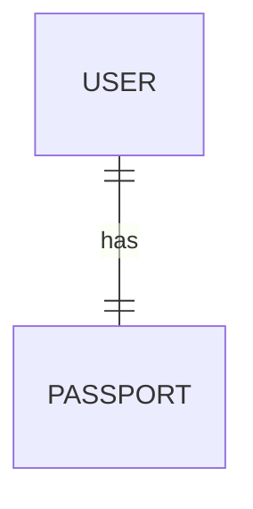
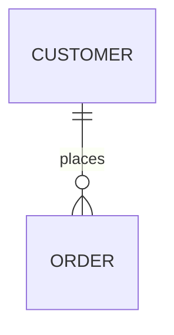
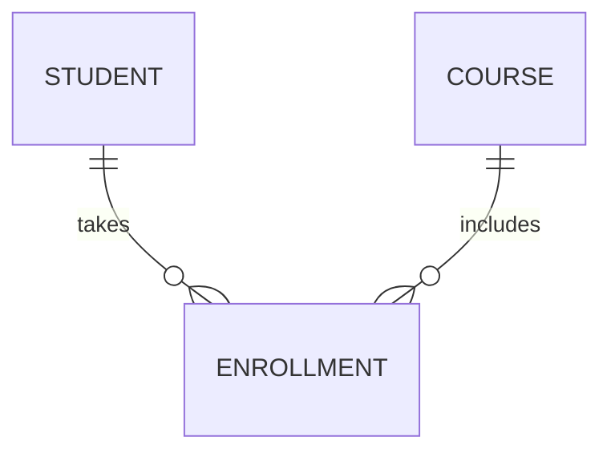
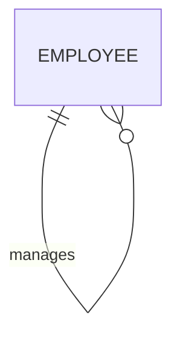
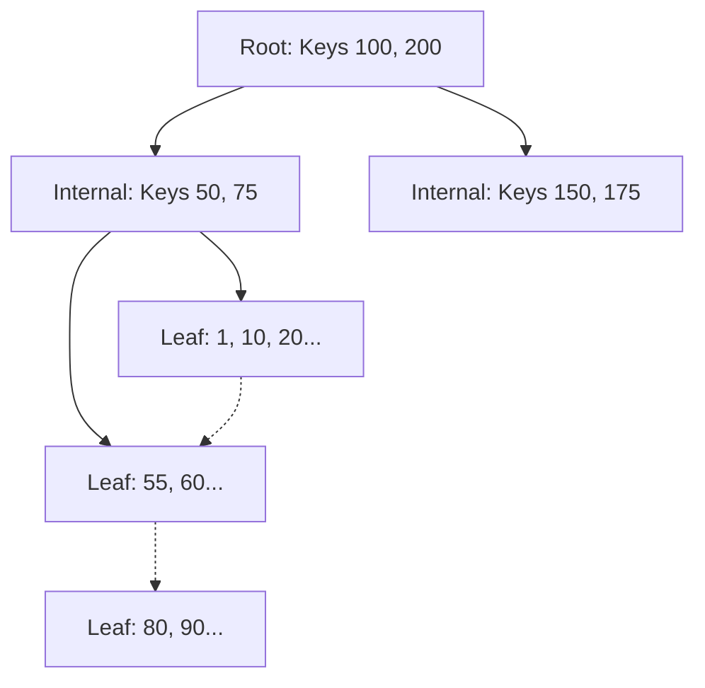
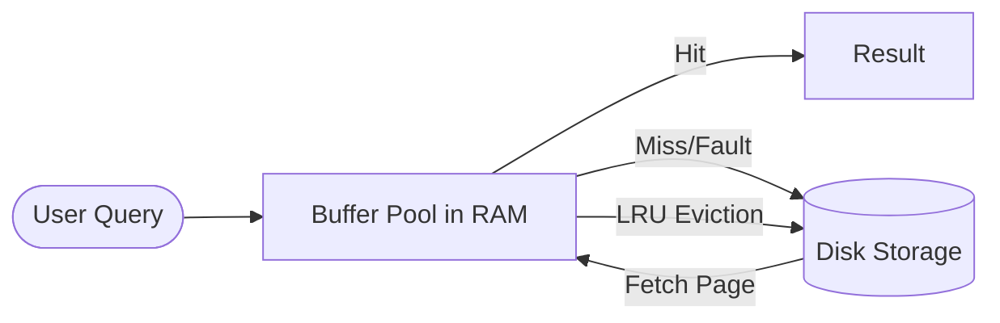

# 🗄️ The Ultimate RDBMS & SQL Mastery Guide (Consolidated)

Welcome to the definitive resource for Relational Database Management Systems. This guide consolidates all previous modules, deep dives, and interview prep into one comprehensive, line-by-line detailed document for your software engineering placement success.

---

## 📑 Table of Contents
1.  [Introduction to Databases & DBMS](#1-introduction)
2.  [ACID Properties & Transactions](#2-acid-properties)
3.  [SQLite vs. MySQL vs. PostgreSQL (Deep Comparison)](#3-db-comparison)
4.  [Database Relationships Visualized](#4-relationships)
5.  [ER Modeling & Deep Dive (Library Case Study)](#5-er-modeling)
6.  [Key Concepts & SQL Constraints](#6-keys-constraints)
7.  [SQL Sub-languages (DDL, DML, DCL, TCL)](#7-sql-sub-languages)
8.  [Data Querying Mastery (DQL)](#8-querying)
9.  [Joins: Connecting the Dots](#9-joins)
10. [Aggregations & Grouping](#10-aggregations)
11. [Subqueries & Performance](#11-subqueries)
12. [Normalization: The Strategy of Storage](#12-normalization)
13. [Advanced Objects (Indexes, Views, Triggers)](#13-advanced-objects)
14. [Python Integration (Drivers & ORMs)](#14-python-integration)
15. [Consolidated Interview Q&A (50+ Questions)](#15-interview-qa)
16. [Final Practice: Assignments & MCQs](#16-practice)
17. [Miscellaneous: The Internal Architecture of RDBMS](#17-internals)

---

## <a name="1-introduction"></a>1. Introduction to Databases & DBMS
### What is a Database?
A database is an organized collection of structured data stored and accessed electronically. A **DBMS (Database Management System)** is the software that interacts with end users, applications, and the database itself to capture and analyze the data.

### File System vs. DBMS: Why we switched
Before DBMS, we used flat files (like Excel or Text files).
-   **Data Redundancy**: File systems often store the same data multiple times (e.g., student name in every course file). DBMS uses normalization to store it once.
-   **Data Integrity**: In a file, you could type "N/A" in an "Age" column. DBMS enforces **Constraints** (Rules) to ensure data type correctness.
-   **Concurrency**: If two people edit an Excel file at once, one's changes might be lost. DBMS uses **Locking mechanisms** for multi-user access.
-   **Real Example**: Managing a library in Excel leads to inconsistent book titles and student names. A Library DBMS ensures a single source of truth.

### RDBMS vs. NoSQL
| Feature | RDBMS (Relational) | NoSQL (Non-Relational) |
| :--- | :--- | :--- |
| **Data Model** | Tables (Rows/Columns) | Documents, Key-Value, Graphs |
| **Schema** | Rigid/Pre-defined | Dynamic/Flexible |
| **Scaling** | Vertical (Bigger Server) | Horizontal (More Servers) |
| **Consistency** | Strong (ACID) | Eventual (BASE) |
| **Use Case** | ERP, Banking, Complex Joins | Real-time apps, IoT, Social Media |

---

## <a name="2-acid-properties"></a>2. ACID Properties & Transactions
A **Transaction** is a logical unit of work. ACID ensures these units remain reliable.

1.  **Atomicity**: "All or Nothing." If a bank transfer fails midway, the money isn't lost; it's returned to the sender.
2.  **Consistency**: Before and after a transaction, the database stays in a valid state (e.g., total money in the bank remains the same after a transfer).
3.  **Isolation**: Even if 100 people transfer money at once, the database processes them so they don't interfere with each other.
4.  **Durability**: Once a transaction is committed, it stays saved even if the power goes out.

**Bank Example SQL:**
```sql
BEGIN TRANSACTION;
UPDATE Accounts SET bal = bal - 500 WHERE id = 'UserA';
UPDATE Accounts SET bal = bal + 500 WHERE id = 'UserB';
COMMIT; -- Or ROLLBACK if something fails
```

---

## <a name="3-db-comparison"></a>3. SQLite vs. MySQL vs. PostgreSQL (Deep Comparison)

Choosing the right database is about matching the engine to the workload.

| Feature | **SQLite** | **MySQL** | **PostgreSQL** |
| :--- | :--- | :--- | :--- |
| **Architecture** | Serverless (Single `.db` file) | Client-Server (Background Process) | Client-Server (Background Process) |
| **Concurrency** | 1 Writer at a time (Database Lock) | High (Row-level Locking) | High (MVCC - No locking for reads) |
| **Features** | Minimalistic, portable | High-speed, Web-standard | Advanced (GIS, JSONB, Arrays) |
| **ACID** | Fully Compliant | Mostly Compliant (InnoDB) | Fully Compliant (Extremely strict) |
| **Data Types** | Weak (Storage Classes) | Standard | Strong (Extensibility, Custom types) |
| **Best For** | Mobile apps, IoT, Testing, CMS | Large-scale Web apps, WordPress | Enterprise, Data Analytics, Complex queries |

### 🛑 When to use what?
-   **Use SQLite** if you are building an Android/iOS app or a small desktop tool. It requires **zero setup** and travels with your code as a single file.
-   **Use MySQL** if you are building a standard high-traffic web application (like a social media clone or e-commerce) where **read speed** is the absolute priority.
-   **Use PostgreSQL** if your application involves **complex data analytical queries**, uses GIS (Geographic info), or needs a database that is "unbreakable" in terms of data consistency.

---

## <a name="4-relationships"></a>4. Database Relationships Visualized
Relationships define how tables link together via keys.

### Type 1: One-to-One (1:1)
One record in A relates to one in B.
-   **Example**: **User & Passport**.


### Type 2: One-to-Many (1:N)
One record in A relates to multiple in B.
-   **Example**: **Customer & Orders**. One customer can buy many things.


### Type 3: Many-to-Many (M:N)
Multiple records in A relate to multiple in B. Requires a **Junction Table**.
-   **Example**: **Students & Courses**.


### Type 4: Self-Referencing (Recursive)
A table joins with itself.
-   **Example**: **Employee & Manager**.


---

## <a name="5-er-modeling"></a>5. ER Modeling & Deep Dive (Library Case Study)
The **Entity-Relationship Model** is the blueprint.
-   **Entity**: Object (Student)
-   **Attribute**: Detail (Student Name)
-   **Relationship**: Link (Student *Issues* Book)

### Case Study: Student–Book–Issue
If we used one table, we'd have massive redundancy. Instead:
-   **Students Table**: `sid`, `name`, `email`
-   **Books Table**: `isbn`, `title`, `author`
-   **Issues Table**: `issue_id`, `sid` (FK), `isbn` (FK), `date`

**Visual Logic**:
| sid | name |
| :--- | :--- |
| 1 | Alice |

| isbn | title |
| :--- | :--- |
| B101 | Python |

| issue_id | sid | isbn |
| :--- | :--- | :--- |
| 50 | 1 | B101 |

---

## <a name="6-keys-constraints"></a>6. Key Concepts & SQL Constraints
### The 5 Essential Keys
1.  **Primary Key (PK)**: Unique and Non-NULL identifier (e.g., SSN).
2.  **Candidate Key**: Potential PKs (e.g., Email, Passport No).
3.  **Foreign Key (FK)**: A PK from another table used to link data.
4.  **Composite Key**: A PK made of multiple columns.
5.  **Super Key**: Any set of columns that uniquely identifies a row.

### SQL Constraints
Rules enforced on columns to maintain integrity:
-   `NOT NULL`: Cannot be empty.
-   `UNIQUE`: No two rows can have the same value.
-   `DEFAULT`: Fallback value if none provided.
-   `CHECK`: Manual logic (e.g., `CHECK (age >= 18)`).

---

## <a name="7-sql-sub-languages"></a>7. SQL Sub-languages (DDL, DML, DCL, TCL)
| Language | Commands | Purpose |
| :--- | :--- | :--- |
| **DDL** (Definition) | `CREATE`, `ALTER`, `DROP`, `TRUNCATE` | Modify the **Schema** (Structure). |
| **DML** (Manipulation)| `INSERT`, `UPDATE`, `DELETE` | Modify the **Data** inside. |
| **DQL** (Query) | `SELECT` | Retrieve data. |
| **DCL** (Control) | `GRANT`, `REVOKE` | Security and Permissions. |
| **TCL** (Transaction)| `COMMIT`, `ROLLBACK`, `SAVEPOINT` | Manage ACID transactions. |

---

## <a name="8-querying"></a>8. Data Querying Mastery (DQL)
The `SELECT` statement is the heart of SQL.

```sql
SELECT DISTINCT name, salary 
FROM Employees 
WHERE dept = 'Engineering' AND salary > 50000 
ORDER BY salary DESC 
LIMIT 5;
```

**Common Patterns**:
-   `LIKE 'A%'`: Starts with A.
-   `IN (1, 2, 3)`: Shorthand for multiple OR conditions.
-   `BETWEEN 10 AND 20`: Inclusive range.

---

## <a name="9-joins"></a>9. Joins: Connecting the Dots
Joins combine rows from two or more tables based on a related column.

-   **INNER JOIN**: Returns only the intersection (common rows).
-   **LEFT JOIN**: All from Left Table + matching Right Rows (NULLs for unmatched).
-   **RIGHT JOIN**: All from Right Table + matching Left Rows.
-   **FULL JOIN**: Union of both tables.
-   **SELF JOIN**: Joining a table with itself (useful for hierarchies).

**Example SQL**:
```sql
SELECT S.name, B.title 
FROM Students S 
LEFT JOIN Issues I ON S.sid = I.sid 
LEFT JOIN Books B ON I.isbn = B.isbn;
```

---

## <a name="10-aggregations"></a>10. Aggregations & Grouping
Aggregate functions return a single value calculated from a set of values.
-   `COUNT()`, `SUM()`, `AVG()`, `MIN()`, `MAX()`

**GROUP BY vs. HAVING**:
-   `GROUP BY`: Collapses rows into summary rows.
-   `HAVING`: Filter groups *after* aggregation (WHERE cannot be used here).

```sql
SELECT dept, AVG(salary) 
FROM Employees 
GROUP BY dept 
HAVING AVG(salary) > 4000;
```

---

## <a name="11-subqueries"></a>11. Subqueries & Performance
A query inside a query.
-   **Scalar Subquery**: Returns 1 value.
-   **Correlated Subquery**: The inner query depends on the outer query (slower).

**Example**:
```sql
-- Find employees earning more than the company average
SELECT name FROM Employees 
WHERE salary > (SELECT AVG(salary) FROM Employees);
```

---

## <a name="12-normalization"></a>12. Normalization: The Strategy of Storage
Organizing columns and tables of a database to ensure that their dependencies are properly enforced by database integrity constraints.

### The Anomalies (The "Bad" Stuff)
-   **Insertion**: Can't add a course unless someone enrolls.
-   **Update**: Change a student's address in 100 rows.
-   **Deletion**: If a student drops a course, we lose the course information.

### Normal Forms
1.  **1NF**: Atomic values (No lists in a cell).
2.  **2NF**: No Partial Dependency (Everything depends on the *whole* PK).
3.  **3NF**: No Transitive Dependency (No attribute depends on a non-key attribute).
4.  **BCNF**: Stronger 3NF (Every determinant must be a Super Key).

---

## <a name="13-advanced-objects"></a>13. Advanced Objects (Indexes, Views, Triggers)
-   **Index**: B-Tree structure for fast search. Slower writes, faster reads.
-   **View**: Virtual table. "Saved SELECT query."
-   **Materialized View**: A view with its physical data saved (refreshed periodically).
-   **Trigger**: Code that automatically fires on `INSERT/UPDATE/DELETE`.

---

## <a name="14-python-integration"></a>14. Python Integration (Drivers & ORMs)
### Parameterized Queries (Security)
Never do `f"SELECT ... WHERE id = {user_id}"` (SQL Injection)!
Use parameters: `cursor.execute("SELECT ... WHERE id = ?", (user_id,))`.

### Sample Transaction Script:
```python
import sqlite3
def safe_issue(sid, isbn):
    conn = sqlite3.connect('lib.db')
    try:
        cur = conn.cursor()
        cur.execute("BEGIN;")
        cur.execute("INSERT INTO Issues...", (sid, isbn))
        cur.execute("UPDATE Books SET stock = stock - 1...", (isbn,))
        conn.commit()
    except Exception as e:
        conn.rollback() # ACID in action
```

---

## <a name="15-interview-qa"></a>15. Consolidated Interview Q&A (50+ Questions)
### Core Basics
1.  **DBMS vs RDBMS?** (RDBMS uses relations/tables).
2.  **What is a NULL value?** (Missing or unknown data, not 0 or space).
3.  **What is a join?** (Query across multiple tables).
4.  **Primary Key vs Unique Key?** (Unique allows 1 NULL, Primary doesn't).
5.  **What is a schema?** (Database blueprint).

### Intermediate Querying
6.  **GROUP BY vs ORDER BY?** (Grouping for math, Ordering for display).
7.  **WHERE vs HAVING?** (Row filter vs Group filter).
8.  **Inner Join vs Left Join?** (Intersection vs All from left).
9.  **UNION vs UNION ALL?** (Remove duplicates vs Keep them).
10. **What is a self-join?** (Table joined with itself).

### Advanced Implementation
11. **Explain the execution order of a SQL query.** (FROM -> WHERE -> GROUP BY -> HAVING -> SELECT -> ORDER BY -> LIMIT).
12. **Materialized View vs View?** (Stored data vs Instant query).
13. **What is normalization?** (Reducing redundancy).
14. **What is denormalization?** (Deliberate redundancy for read speed).
15. **Clustered vs Non-clustered index?** (Dictates physical order of data vs a separate look-up table).

---

## <a name="16-practice"></a>16. Final Practice: Assignments & MCQs
1.  **ER Modelling**: Design a schema for "Smart Delivery" (Courier, Customer, Package).
2.  **Queries**: Write a query for the 3rd highest salary without `LIMIT`.
3.  **Transactions**: Write pseudocode for an ATM withdrawal.
4.  **Joins**: List all customers who have never made a purchase.

---

## <a name="17-internals"></a>17. Miscellaneous: The Internal Architecture of RDBMS

For a senior engineer, knowing SQL isn't enough. You must understand the "Engine" under the hood.

### A. The Core Data Structure: B+ Trees
Most RDBMS (MySQL InnoDB, Postgres) use **B+ Trees** for indexes. Unlike a standard Binary Tree where every node stores data, a B+ Tree is specialized for disk storage.

-   **Internal Nodes**: Only store keys to "route" the search. Because they don't store row data, we can fit thousands of keys in one internal node (High Fan-out).
-   **Leaf Nodes**: This is where the actual row pointers (or rows) live.
-   **Linked Leaves**: All leaf nodes are connected in a doubly-linked list. This allows the DB to perform range queries (e.g., `WHERE id BETWEEN 10 AND 20`) by finding '10' and then simply following the links until it hits '20'.
-   **Height ($H$):** A B+ Tree with a fan-out of 100 and height 3 can store $100^3 = 1,000,000$ records. This means finding any record takes exactly 3 disk reads.



### B. Storage & File Operations (Pages and Blocks)
Databases don't read "files"; they read **Pages** (typically 8KB or 16KB).
-   **Buffer Pool**: A region in RAM. When you ask for data, the DB first checks if the page is in the Pool.
-   **Page Fault**: If not in RAM, the DB pauses, goes to Disk, fetches the Page, and puts it in the Pool.


-   **LRU (Least Recently Used)**: If the Buffer Pool is full, the DB kicks out the oldest page to make room.

### C. Maintaining Consistency: WAL & MVCC
How different systems handle safety:

-   **WAL (Write-Ahead Logging)**: 
    -   **SQLite**: By default, SQLite used a "Rollback Journal." But in **WAL Mode**, it writes changes to a `-wal` file first. This allows multiple readers to read the main DB file while one person writes to the WAL file. High concurrency for SQLite!
    -   **Postgres/MySQL**: Use WAL extensively to ensure Durability.
-   **MVCC (Multi-Version Concurrency Control)**: 
    -   **PostgreSQL**: Keeps old versions of rows in the main table. Requires "Vacuuming" to clean up eventually.
    -   **MySQL (InnoDB)**: Uses a **Rollback Segment** in the Undo Log. It stores the old version of the data in a separate log so readers can see "the past" while writers update the present.

### D. The Query Processor API
Every database has a **Cursor API**. Here is how you interact with them in Python.

#### SQLite3 (Standard Library)
SQLite parses and executes queries in the same process as your app.
```python
import sqlite3
# SQLite uses WAL for concurrency if enabled
db = sqlite3.connect('app.db')
db.execute("PRAGMA journal_mode=WAL;") 
cursor = db.cursor()
cursor.execute("SELECT * FROM users")
```

#### MySQL (Client-Server)
MySQL requires a network driver. The `Optimizer` lives on the MySQL Server, not in your Python code.
```python
import mysql.connector
# MySQL uses InnoDB's Buffer Pool for caching
db = mysql.connector.connect(host="localhost", user="root", password="pw")
cursor = db.cursor()
cursor.execute("SELECT * FROM orders")
```

---
*End of Ultimate Guide. You are now prepared for RDBMS placement interviews.*
